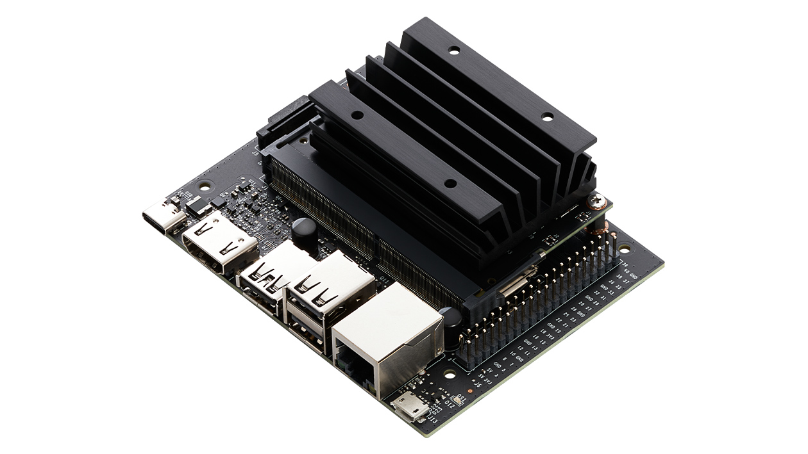

# NVIDIA Jetson Nano Developer kit (4Gb)

This is the base Nerves System configuration for the [Jetson Nano 2Gb Developer kit](https://www.nvidia.com/en-us/autonomous-machines/embedded-systems/jetson-nano/education-projects/).


<br><sup>[Image credit](#nvidia)</sup>

| Feature              | Description                     |
| -------------------- | ------------------------------- |
| CPU                  | Quad-core ARM A57 @ 1.43 GHz    |
| GPU                  | 128-core NVIDIA Maxwell™        |
| Memory               | 2 GB 64-bit LPDDR4 25.6 GB/s    |
| Storage              | MicroSD                         |
| Linux kernel         | 4.9.140 w/ OE4T patches         |
| IEx terminal         | UART `ttyS0`                    |
| GPIO, I2C, SPI       | Yes - [Elixir Circuits](https://github.com/elixir-circuits) |
| UART                 | ttyS0 + more via device tree overlay |
| Camera               | MIPI CSI-2 x2 (15-position Flex Connector) |
| Ethernet             | Gigabit Ethernet                |
| WiFi                 | M.2 Key-E with PCIe x1          |
| USB                  | 1x USB 3.0 Type A, 2x USB 2.0 Type A, 1x USB 2.0 Micro-B |

## Known issues

This system is under development. Components of the system may change without
upgrade paths until the partition structure and included helper libraries are
added. It is also unclear what will be required in the system to support
cross compiling for CUDA and the inclusions are subject to change. Other
quirks and known issues are:

* Reboot sometimes hangs when rebooting too soon after boot.
  It seems to be associated with `sdhci-tegra`.
  When the reboot hangs, eventually the message
  `sdhci-tegra sdhci-tegra.0: Tuning done` will be seen and the system will
  reboot.

## Using

The most common way of using this Nerves System is create a project with `mix
nerves.new` and to export `MIX_TARGET=jetson_nano_2g`. See the [Getting started
guide](https://hexdocs.pm/nerves/getting-started.html#creating-a-new-nerves-app)
for more information.

If you need custom modifications to this system for your device, clone this
repository and update as described in [Making custom
systems](https://hexdocs.pm/nerves/systems.html#customizing-your-own-nerves-system)

## Console access

The console is configured to output to the pins on header J12 located under the
Jetson Nano module on the carrier board. A 3.3V FTDI cable is needed to
access the output.

## Provisioning devices

This system supports storing provisioning information in a small key-value store
outside of any filesystem. Provisioning is an optional step and reasonable
defaults are provided if this is missing.

Provisioning information can be queried using the Nerves.Runtime KV store's
[`Nerves.Runtime.KV.get/1`](https://hexdocs.pm/nerves_runtime/Nerves.Runtime.KV.html#get/1)
function.

Keys used by this system are:

Key                    | Example Value     | Description
:--------------------- | :---------------- | :----------
`nerves_serial_number` | `"12345678"`       | By default, this string is used to create unique hostnames and Erlang node names. If unset, it defaults to part of the BBB's serial number.

The normal procedure would be to set these keys once in manufacturing or before
deployment and then leave them alone.

For example, to provision a serial number on a running device, run the following
and reboot:

```elixir
iex> cmd("fw_setenv nerves_serial_number 12345678")
```

This system supports setting the serial number offline. To do this, set the
`NERVES_SERIAL_NUMBER` environment variable when burning the firmware. If you're
programming MicroSD cards using `fwup`, the commandline is:

```sh
sudo NERVES_SERIAL_NUMBER=12345678 fwup path_to_firmware.fw
```

Serial numbers are stored on the MicroSD card so if the MicroSD card is
replaced, the serial number will need to be reprogrammed. The numbers are stored
in a U-boot environment block. This is a special region that is separate from
the application partition so reformatting the application partition will not
lose the serial number or any other data stored in this block.

Additional key value pairs can be provisioned by overriding the default provisioning.conf
file location by setting the environment variable
`NERVES_PROVISIONING=/path/to/provisioning.conf`. The default provisioning.conf
will set the `nerves_serial_number`, if you override the location to this file,
you will be responsible for setting this yourself.

## Linux and U-Boot versions

The Jetson nano Linux kernel originates from the NVIDIA Linux4Tegra (L4T)
repository at `nv-tegra.nvidia.com/linux-4.9.git`. The kernel expects a
number of other repositories to be located at paths relative to the kernel.
OpenEmbedded4Linux (OE4L) has created a copy of the NVIDIA Tegra upstream kernel
with these files pulled into the kernel tree and the relative paths
have been updated to reference the in tree locations. OE4L has also added
a number of patches required to compile the kernel using GCC 9 / 10.

U-Boot originates from `nv-tegra.nvidia.com/3rdparty/u-boot.git` with
patches originally coming from OE4T. The OE4T U-Boot patches have been updated
to work with U-Boot 2021.01.

[Image credit](#nvidia): This image is from [Nvidia](https://www.nvidia.com/en-us/autonomous-machines/embedded-systems/jetson-nano/education-projects/).
